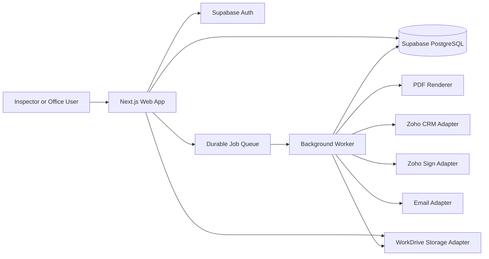
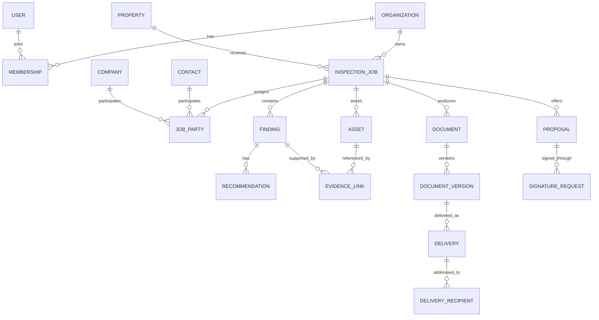

# System Blueprint

## Architecture

Start as a modular monolith with three deployable concerns:

1. Web application: Next.js App Router, React, TypeScript, and Supabase Auth.
2. Background worker: document generation, delivery, CRM synchronization, WorkDrive transfers, imports, and provider retries.
3. Supabase PostgreSQL plus Zoho WorkDrive file storage.

The web app and worker share domain packages and database types. Long-running work is persisted as jobs and never depends on an open browser request.



## Domain Modules

### Identity

Organizations, users, memberships, roles, permissions, Supabase sessions, and Row Level Security.

### CRM Directory

Contacts, companies, addresses, properties, CRM external references, merge state, and synchronization state.

### Inspection Jobs

Jobs, appointments, report type, prior-report relationship, assigned inspector, job stage, due dates, and operational status.

### Job Parties

Role assignments between a job and a contact/company. A party may have multiple roles and role-specific delivery preferences.

### Inspection Authoring

Template version, inspection sections, observations, findings, recommendations, categories, severity, Section I/II classification, and completion state.

### Evidence

Assets, WorkDrive identifiers, image metadata, upload state, evidence links, annotations, diagram source JSON, diagram render, and version history.

### Documents

Document definitions, generation requests, immutable versions, templates, render status, checksums, and WorkDrive artifacts.

### Communications

Delivery drafts, recipients, attachments/document versions, send attempts, provider IDs, status events, bounce/failure details, and CRM activity synchronization.

### Proposals And Signatures

Proposal lines, pricing, contract versions, signer assignments, signature requests, signature events, and signed artifacts.

### Operations

Treatment work orders, scheduling, crew sheets, completion evidence, invoices, and NOC. This boundary is reserved early but implemented after the core report flow.

### Audit

Append-only actor, action, entity, before/after summary, request correlation, timestamp, and source.

## Core Data Relationships



## File Lifecycle

1. The browser sends a file to a server-side upload route.
2. The route validates organization access, filename, size, and content type.
3. The WorkDrive adapter uploads the bytes into the appropriate job folder.
4. The application stores a stable asset record containing the WorkDrive file ID and metadata.
5. A worker performs any additional validation and creates image variants where required.
6. Documents reference stable application asset IDs, never permanent public URLs.
7. Preview, download, and PDF rendering resolve private file access through the provider adapter.

A provider outage can delay uploads or document rendering, but it cannot erase already-saved findings, contacts, or inspection text in PostgreSQL.

## Supabase Security Model

Every operational table carries an `organization_id`. Row Level Security is enabled on all public tables. Authenticated users receive access only through an active organization membership.

Initial roles:

- administrator;
- manager;
- office coordinator;
- inspector;
- treatment coordinator.

Access responsibilities:

- administrators manage invitations, active memberships, roles, suspensions, and organization settings;
- managers oversee inspection operations and report approval without granting administrator access;
- office coordinators create and maintain jobs, contacts, report content, and delivery preparation;
- inspectors work in assigned inspection authoring areas without organization-management access;
- treatment coordinators are reserved for treatment operations and read-oriented handoff workflows.

Team access is invitation-only. A fresh invitation establishes a short-lived Supabase
session, then routes the recipient through an Inspect360 activation page to set their
name and password. Invitation records retain status, expiry, resend count, acceptance,
revocation, and optional inspector-profile linkage. Administrators can resend or revoke
pending invitations and can change or suspend active memberships. The system prevents
an administrator from removing their own access or suspending the final active
administrator.

The first organization is created through a security-definer onboarding function that also assigns the creating user as administrator. Secret/service-role credentials are never exposed to browser code.

## Zoho CRM Synchronization

The custom app owns operational inspection state. CRM retains relationship records and desired communication activity.

Each synchronized record stores:

- local entity ID;
- Zoho module and record ID;
- synchronization status;
- last successful sync time;
- last error;
- provider metadata.

Outbound changes use idempotency keys. Inbound updates arrive through notifications/webhooks where available, with scheduled reconciliation as a safety net. Conflict rules are explicit per field; neither system silently overwrites the other.

## Email And Communication Boundary

The application does not assume that sending and CRM logging are the same operation.

A communication provider sends the message and returns a provider message ID. A separate CRM activity adapter records or links the communication in Zoho CRM. This permits one of these paths after a short integration spike:

- send through a Zoho-supported mail/CRM endpoint and record automatically;
- send through a transactional provider and create the corresponding CRM activity;
- use an organization mailbox and synchronize the activity.

The final choice depends on deliverability, attachment limits, CRM visibility, and available Zoho API behavior.

## Reliability Rules

- provider calls run through durable jobs with retries and exponential backoff;
- every job handler is idempotent;
- document generation uses a captured data snapshot;
- delivery always points to a specific document version;
- signature requests cannot be duplicated by retry;
- audit events and provider request correlation IDs are retained;
- UI displays queued, processing, completed, and failed states;
- provider outages never erase user-entered inspection data.

## Security Baseline

- organization-scoped Row Level Security on every operational table;
- least-privilege roles and explicit sensitive actions;
- private WorkDrive files resolved through server-side access;
- OAuth tokens encrypted at rest;
- secrets only in deployment secret management;
- file validation before downstream rendering;
- immutable audit records for sends, approvals, signatures, and exports;
- backups and restore tests for database and final documents.

## Repository Shape

```text
app/                    Next.js routes and layouts
components/             reusable UI components
modules/                domain modules and application services
integrations/           Zoho, storage, email, signing, and AI adapters
workers/                durable job handlers
lib/                    shared infrastructure
supabase/migrations/    versioned PostgreSQL migrations
docs/architecture/      product and system blueprints
docs/decisions/         architecture decision records
docs/zoho/              audited Creator behavior and migration notes
```

## Delivery Sequence

1. Foundation: repository, design system, Supabase auth, database schema, WorkDrive adapter, and job shell.
2. Inspection authoring: job parties, evidence, diagram, findings, and readiness.
3. Documents: report snapshots, PDF generation, versions, and preview.
4. Send Center: recipient selection, email delivery, delivery history, and CRM activity sync.
5. Contracts: proposal generation, signer selection, Zoho Sign, and signed files.
6. Migration: repeatable import with reconciliation reports.
7. Operations: treatment, crew sheets, invoicing integration, and NOC.
